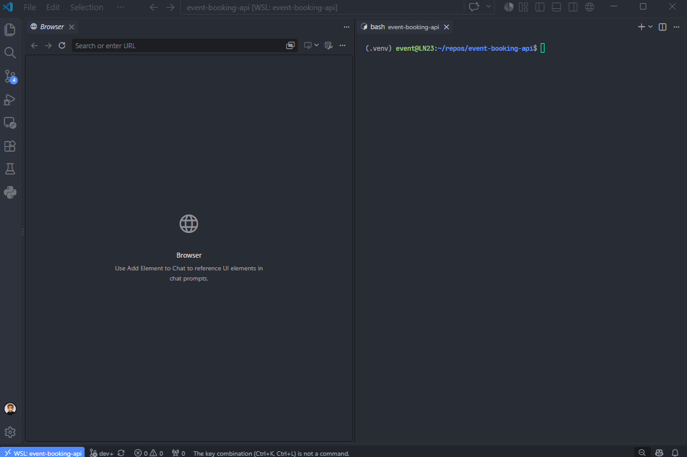

# Event Booking API


A backend system for publishing, booking and maintaining events, based on REST API architecture with a role-based access control model. Built with **FastAPI**, **Pydantic**, **SQLAlchemy**, **PostgreSQL**, and containerized with **Docker**.

## 🚀 Table of contents
- [📘 About the project](#-about-the-project)
- [✨ Features](#-features)
- [🎯 Design objectives](#-design-objectives)
- [🎬 Demo](#-demo)
- [📐 Design notes](#-design-notes)
- [📑 API endpoints overview](#-api-endpoints-overview)
- [📦 API response structure](#-api-response-structure)
- [🗂️ Project structure](#️-project-structure)
- [📌 Project status](#-project-status)
- [📋 Requirements](#-requirements)
- [⚙️ Installation](#️-installation)
- [🔧 Configuration](#-configuration)
- [▶️ Running the system](#️-running-the-system)
- [🧱 Builder CLI](#-builder-cli)
- [🧪 Tests](#-tests)
- [🤖 CI](#-ci)
- [🪝 Git hooks](#-git-hooks)
- [🚧 Known limitations](#-known-limitations)
- [🛣️ Roadmap](#️-roadmap)
- [👤 Author contact](#-author-contact)
- [📄 License](#-license)

## 📘 About the project
Event Booking API is an educational backend project built as a REST API. It provides a set of endpoints to browse, book, create, publish and edit events. It has a built-in RBAC model, JWT authentication, password hashing, ownership control, request
and response validation, and protection against overbooking. It ships with a Builder CLI for a quick installation process and system resource management.

## ✨ Features
### API
- REST API built on FastAPI
- Swagger UI for exploring the endpoints
- Short and simplified endpoint structure in the routers
- Request and response validation and filtering with Pydantic
- Pagination on listing endpoints, returning the total row count alongside the page
- Uniform response envelope on every answer, success, fail or error, with two documented exceptions
- Registered exception handlers, so no error path answers outside the envelope
- Maintainable and simple to expand application structure

### Access control and security
- JWT authentication
- Argon2 password hashing
- Endpoint access control by user role
- Resource access control by ownership
- First admin account created on boot when the database holds none

### Domain and data
- Event lifecycle enforced by an allowed-transition map
- Row locking that prevents an event from being oversold
- One active booking per user and event, enforced by an index
- PostgreSQL database with constraints, indexes and triggers
- Custom SQLAlchemy column type that refuses anything but a hashed password, on write and on read.
  Moreover this mechanism can be easily implemented for different columns, in order to protect sensitive data.
- Application works explicitly on UTC time

### Application environment
- Containerized environment
- Builder CLI for easy installation, environment operations and resource management
- Alembic migrations applied automatically on container start
- Rotating logging per component: application, CLI, HTTP access and server

## 🎯 Design objectives
- Keep the endpoint body as short and simple as possible: no logic, no database communication, no error handling.
- Keep the application code and structure simple and maintainable.
- Divide the API elements by responsibility.
- Avoid code repetition (still a work in progress).
- Keep detailed docstrings and comments, since the project is educational.
- Protect sensitive data: keep it out of logs, responses and the command line.
- Answer with one response shape everywhere, so a client always parses a single structure.
- Implement the data safeguards PostgreSQL provides (in progress).

## 🎬 Demo


## 📐 Design notes
The detailed design description, including the diagrams, is kept in a separate document, because it is too much for a README. [Design notes](docs/design.md).

## 📑 API endpoints overview
25 endpoints. The interactive documentation via Swagger UI can be accessed at `http://localhost:8000/docs`, once the app is running.

Ordered by role strength, since higher roles inherit access from lower roles.

| Method | Path | Role | Handler |
|---|---|---|---|
| GET | /health | — | health_check |
| POST | /auth/token | — | login_for_access_token |
| POST | /users | — | register_user |
| GET | /events | — | list_events |
| GET | /events/{event_id} | — | get_event |
| GET | /me | user | get_me_info |
| PUT | /me | user | update_me_profile |
| PUT | /me/password | user | change_me_password |
| GET | /me/bookings | user | list_me_bookings |
| POST | /events/{event_id}/bookings | user | book_event |
| POST | /me/bookings/{booking_id}/cancel | user | cancel_me_booking |
| GET | /organizer/events | organizer | list_me_events |
| POST | /organizer/events | organizer | create_event |
| GET | /organizer/events/{event_id} | organizer | get_me_event |
| PUT | /organizer/events/{event_id} | organizer | update_event |
| DELETE | /organizer/events/{event_id} | organizer | delete_event |
| PUT | /organizer/events/{event_id}/status | organizer | change_event_status |
| POST | /organizer/events/{event_id}/publish | organizer | publish_event |
| POST | /organizer/events/{event_id}/cancel | organizer | cancel_event |
| GET | /organizer/events/{event_id}/participants | organizer | list_event_participants |
| GET | /admin/users | admin | list_users |
| GET | /admin/users/{user_id} | admin | get_user |
| PUT | /admin/users/{user_id}/role | admin | change_user_role |
| GET | /admin/events | admin | list_events |
| GET | /admin/events/{event_id} | admin | get_event |

## 📦 API response structure
A JSend-inspired envelope, with the same four fields on every success, fail and error. Unlike JSend, `code` and `message` are always present, not only on errors.

The OAuth2 token endpoint and the healthcheck are the two exceptions.

### Standard
```json
{
  "status": "success",
  "code": "ME_INFO_RETRIEVED",
  "message": "Me info retrieved successfully.",
  "data": {
    "email": "jane@example.com",
    "username": "jane",
    "role": "user",
    "first_name": "Jane",
    "last_name": "Doe"
  }
}
```

### Paginated
The `data` field carries the current page, number of pages and the total row count. The API client receives all the data without calculating anything.

```json
{
  "status": "success",
  "code": "EVENTS_RETRIEVED",
  "message": "Events retrieved successfully.",
  "data": {
    "items": [
      {
        "id": 3,
        "name": "PyCon",
        "description": null,
        "location": "Warsaw",
        "capacity": 200,
        "status": "active",
        "starts_at": "2026-11-04T09:00:00Z",
        "ends_at": "2026-11-06T17:00:00Z"
      }
    ],
    "page": 1,
    "pages": 3,
    "total": 42
  }
}
```

### Fail - 4xx
```json
{
  "status": "fail",
  "code": "HTTP_ERROR",
  "message": "Not Found",
  "data": null
}
```

### Error - 5xx
```json
{
  "status": "error",
  "code": "INTERNAL_SERVER_ERROR",
  "message": "Internal server error.",
  "data": null
}
```

## 🗂️ Project structure
```
event-booking-api/
├── app/                    API main module
│   ├── api/                Response envelope, codes, errors, pagination
│   ├── assistants/         Endpoint logic, access control, one class per role
│   ├── bootstrap/          Bootstrap admin creation
│   ├── core/               Settings, security, logging, exception handlers
│   ├── db/                 Engine, session, models, custom data types
│   ├── dependencies/       FastAPI dependencies, grouped by what they build
│   ├── routers/            Endpoints, grouped by minimum role
│   ├── schemas/            Pydantic validation and filtering models
│   ├── services/           All database operations
│   ├── cli.py              API internal CLI, currently boot operations only
│   └── main.py             Application startup, factory mode
├── builder/                Environment management CLI, standard library only
│   ├── config/             Configuration data: environments, paths, revision order, secret names
│   ├── helpers/            Functions for filesystem operations, revisions, secrets and the rest
│   ├── system/             Subprocesses and docker, with output streamed to the terminal
│   ├── revisions/          Hand-written static revision templates, applied by `rebuild-schema`
│   └── dataset/            Dataset for demonstration and testing
├── alembic/                Database migrations
├── docker/                 Dockerfile, compose files, entrypoint
├── requirements/           Dependency files and their respective locks
└── tests/
    └── unit/               Tests that need no running environment
```

## 📌 Project status
**MVP, version 0.1.0.** The complete loop works end to end: register, log in, create an event, publish it, book a ticket, cancel the booking, cancel the event.

25 endpoints, static analysis and continuous integration are set up. The test suite along with additional features and fixes is in development.

> Developed and tested on Ubuntu 26.04 under WSL2, with Docker Engine installed inside the distribution.

## 📋 Requirements
- Python 3.14+
- Linux or WSL2
- Docker Engine with the Compose plugin

> Docker Desktop was not used, therefore it is unsupported here.

## ⚙️ Installation
```bash
git clone https://github.com/Glover012/event-booking-api.git
cd event-booking-api
```

Create and activate a virtual environment:
```bash
python3.14 -m venv .venv && source .venv/bin/activate
```

Install the project together with its development dependencies. `-e .` installs the `builder` command into the virtual environment, so while the environment is active `builder` is on `PATH`. Commands that only read, such as `builder status`, work
from any directory. Other builder commands should be executed from the repository root.
```bash
pip install -e . -r requirements/requirements-dev.lock
```

### WSL2
Make sure that the repository is inside the Linux filesystem, e.g. `~/projects`. Avoid `/mnt/c` or any other Windows path.

Install WSL2 by following [Microsoft's guide](https://learn.microsoft.com/windows/wsl/install). The **Ubuntu 26.04** distribution already ships Python 3.14 and git, so Docker Engine is the only thing left to install.

#### Docker Engine installation
- Follow [Docker's guide](https://docs.docker.com/engine/install/ubuntu/#install-using-the-repository).
- Then add your account to the `docker` group, as the [post-installation guide](https://docs.docker.com/engine/install/linux-postinstall#add-your-user-to-the-docker-group) describes. The local environment relies on it, since it is the one that
  needs no sudo at all.

## 🔧 Configuration
Nothing has to be configured by hand. The `builder` CLI takes care of everything. More details in the [Builder CLI](#-builder-cli) section.

- Application config: [`app/core/config.py`](app/core/config.py)
- Builder environment config: [`builder/config/environments.py`](builder/config/environments.py)

## ▶️ Running the system
Run the local or container environment. Keep in mind that only one environment can run at a time. Add `--seed` on the first run to fill the database with demo data, described in [Seed data](#seed-data).
```bash
builder local up      # or: builder container up
```

Copy the `bootstrap_admin_password` printed in the terminal. It is the password for the `master_admin` account.

Open Swagger UI at `http://localhost:8000/docs`.

Stop it with `Ctrl+C`, then `builder local down` to stop the database container.

## 🧱 Builder CLI
A built-in CLI that starts and tears down the application, offering two environments and a set of commands for the resources around them.

### Commands
| Command | Description |
|---|---|
| builder local up | Start the environment, generate secrets when missing. Existing secrets and volumes are reused. Ends by replacing the terminal process with uvicorn. |
| builder local up --no-api | The same, without starting the uvicorn server. Used mainly in CI. |
| builder \<env\> up --seed | Also load the full demo dataset. Applied only when no database volume exists, so data that is already there is never touched. |
| builder \<env\> up --seed admin | The same, but loads a single admin account instead of the whole dataset. Used by test runs that have to start from an empty system with a known admin account. |
| builder container up | Start the full stack in containers. |
| builder \<env\> down | Stop the environment. Nothing is removed unless a flag is given. |
| builder \<env\> down --logs | Also remove the log directory. Irreversible. |
| builder \<env\> down --data | Also remove the database volume and the secrets. Irreversible. |
| builder \<env\> down --all | Remove both --logs and --data. |
| builder \<env\> files | Create any missing secret file, and `.env` (for local only), without starting anything. Used mainly to run tests that need no database. |
| builder status | Print status for every environment: running services, and the presence of log files, secrets and volumes. |
| builder rebuild-schema | Regenerate the Alembic revisions from the database models and re-apply the static revisions. Destructive, operates on the local environment only. |

- `--data`: removes the volume and the secrets together on purpose. The secrets directory holds `postgres_password`, and that password only reaches Postgres while its data directory is being initialised, so a newly generated one would leave a
  database nothing can log into.
- `rebuild-schema`: asks once, then removes the components of the local environment: volume, secrets, logs and every file in [`alembic/versions`](alembic/versions). It regenerates the initial revision from the db models, re-applies the static revision templates from
  [`builder/revisions`](builder/revisions) on top of it, and verifies the migrations in both directions with `alembic upgrade head` and `alembic downgrade base`.
- `--seed`: streams one dataset from [`builder/dataset`](builder/dataset) into `psql` inside the Postgres container, as a single transaction. A bare `--seed` loads [`seed_full.sql`](builder/dataset/seed_full.sql), the whole demo dataset. `--seed admin` loads [`seed_admin.sql`](builder/dataset/seed_admin.sql) instead: one admin account and nothing else, which is required for automated test runs. The volume presence is checked before the containers start, so an existing database and existing data are never touched.
  In order to run it, remove the database volume first with: `builder <env> down --data`.

### Seed data
Data for tests and demonstration. It is raw SQL, so the dataset survives every refactor of the code and it is possible to bypass some API protections, like creating events in the past.

Every value is structured and follows one pattern. The accounts are `user1`, `organizer1` and `admin1`, numbered upward, with their attributes and owned resources named accordingly.
All share the same password `test`. The exception is the bootstrap `master_admin`, which is created on application boot when the database holds no admin. Its password is randomly generated and printed, then the CLI offers to delete the file right after.

There are two datasets. `seed_full.sql` holds the full dataset: the accounts, events and bookings. `seed_admin.sql` holds only one admin account, `admin1`, with the same password. It exists so an automated test run can log in as an administrator without anything else being loaded into the database, except the bootstrap `master_admin`, which is always created before any dataset is applied.

### Environments
The application has two configured environments, **local** and **container**.

#### Local
Postgres server in a container, the API on the host with `uvicorn --reload`, so every edit reloads the app. Mainly used for development: the command replaces the terminal process with uvicorn.

Requires a `.env` file, which is regenerated on every `builder local up` from the local environment configuration.

#### Container
Everything in containers, the API started from the [Dockerfile](docker/Dockerfile) `CMD` without reload. Migrations and the bootstrap admin run from [`docker/docker-entrypoint.sh`](docker/docker-entrypoint.sh). Does not use a `.env` file, since every variable is passed through the environment of the
subprocess that runs docker.

> At the moment both **cannot run at the same time**, since both occupy the same host port 8000. `builder <environment> up` refuses to start when the other environment is already running.

### Environment configuration
Configuration of the environments can be found here: [`builder/config/environments.py`](builder/config/environments.py).

### Secrets
The three secret files are created on `builder <env> up` once and then reused, unless removed.

The Builder CLI never writes secrets into `.env` and never passes them as environment variables to subprocesses. All secrets are written into files: the local environment keeps them in `secrets/` inside the repository, the container environment in
`/var/lib/event-booking/secrets`, owned by root.

Only `bootstrap_admin_password` is printed. Right after the bootstrap admin account is created the CLI offers to delete the file on the spot. Copy it, remove the file, log in and change the password.

## 🧪 Tests
The test suite needs the generated files before it can import the API, because the settings resolve the database URL while the module is being imported:
```bash
builder local files
```

```bash
pytest tests/unit
```

[`tests/unit`](tests/unit) needs no database and no running application. It currently only tests whether any endpoint method and path pair is repeated, which FastAPI never reports on its own. Routing silently answers with the first one.

## 🤖 CI
Three jobs run on every push to `main` and `dev`, and on every pull request to `main`:

| Job | Description |
|---|---|
| unit tests | `builder local files`, then `pytest tests/unit` |
| lint | `ruff check` and `ruff format --check` |
| types | `mypy` |

Jobs are separated, so a failing one does not hide the others. Dependencies are installed from [`requirements/requirements-dev.lock`](requirements/requirements-dev.lock), so a new release of some tool or framework will not turn the build red.

## 🪝 Git hooks
A `pre-commit` hook runs the linter, the formatter check and the type checker before every commit.

The tests are skipped here, since they may take a while to run once there are more of them. Tests run in CI.

The hook is located in [`.githooks/pre-commit`](.githooks/pre-commit) instead of `.git/hooks/`, so it stays in the repository.

This hook does not work until git is pointed at it. Enable it with:
```bash
git config core.hooksPath .githooks
```

Hooks can be skipped with `git commit --no-verify`.

## 🚧 Known limitations
- Only one environment at a time, since local and container both occupy port 8000.
- Events do not become finished automatically. The status transition has to be made by the organizer.
- The public event model does not expose how many tickets are left. Clients see capacity but not availability.
- No rate limiting on any route.
- The test suite only checks for duplicate routes.
- Admins cannot block accounts and cannot moderate events.
- Containers run as the root user.
- Old data is never removed.

## 🛣️ Roadmap
### 📝 Planned
- Fix the items listed under Known limitations first.
- Tests:
  - database constraints, the booking row lock, the cancel transaction and overbooking.
  - the service layer.
  - access control, user validation and assistant logic.
  - end to end over HTTP against the containerised stack.
- Refactor the service layer, where the code can be simplified and reduced.
- Add database row lock timeout.
- Automatic status transition to finished after the event ends.
- A non-root user in the API container image.
- Linter for shell scripts, once there is more than just the Docker entrypoint.
- Secret rotation.
- Publish the image on Docker Hub, once the project grows bigger.
- Stop validating tokens with Postgres. Build the token lifecycle mechanics together with Redis container.

## 👤 Author contact
- GitHub: https://github.com/Glover012
- E-mail: glover012-git@protonmail.com

## 📄 License
MIT. [LICENSE](LICENSE).

