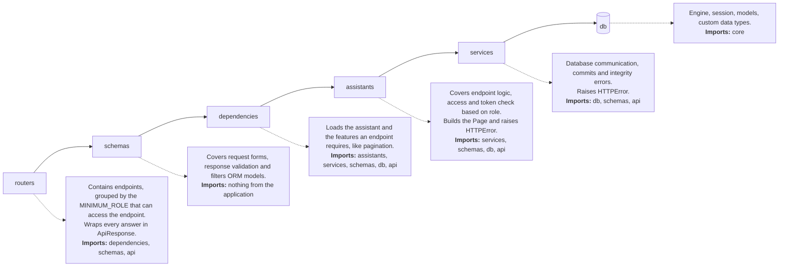
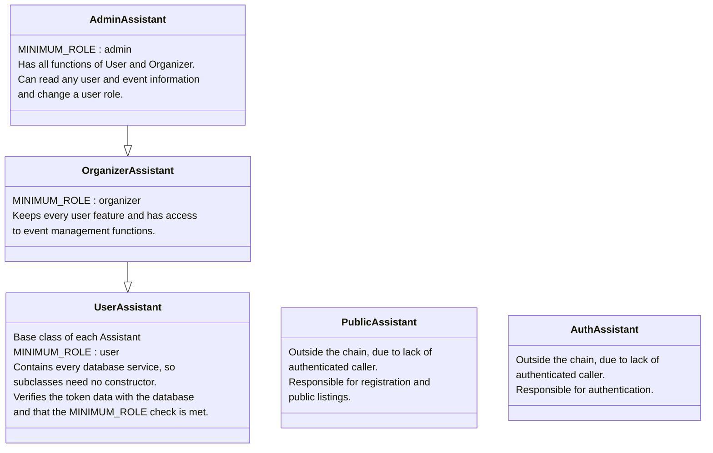
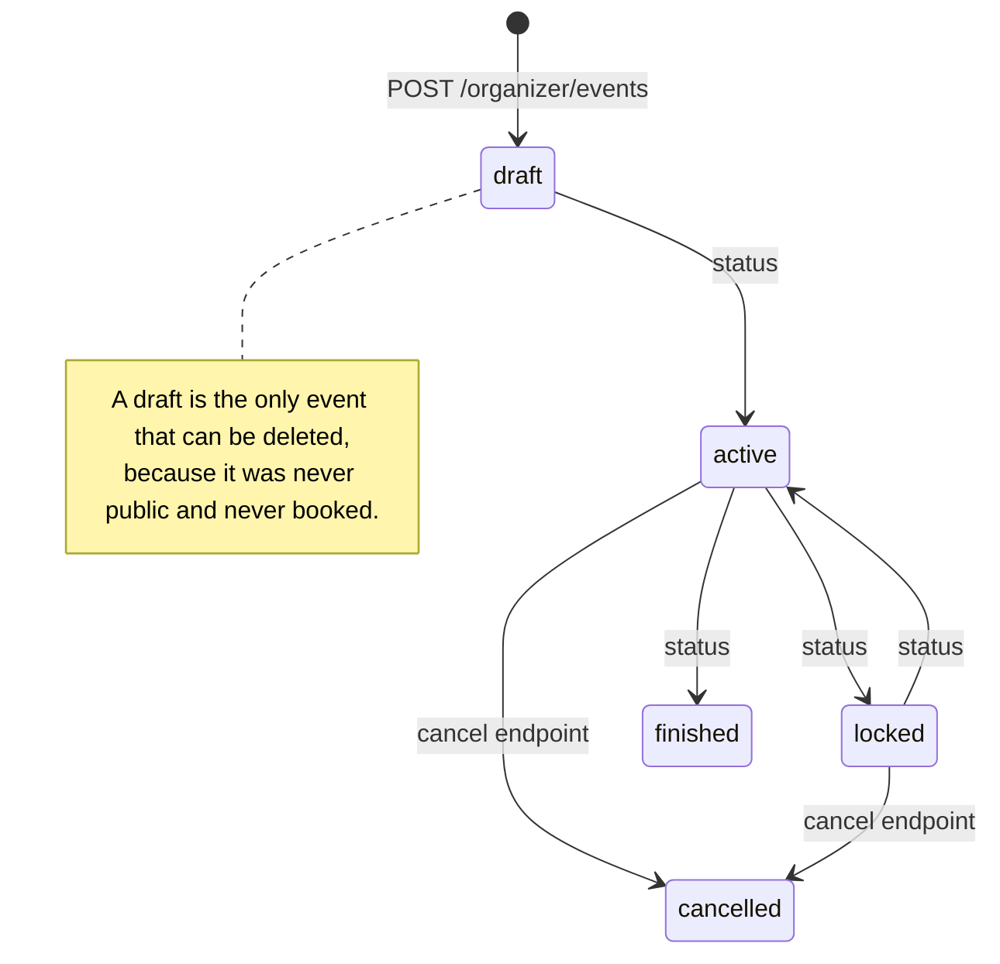
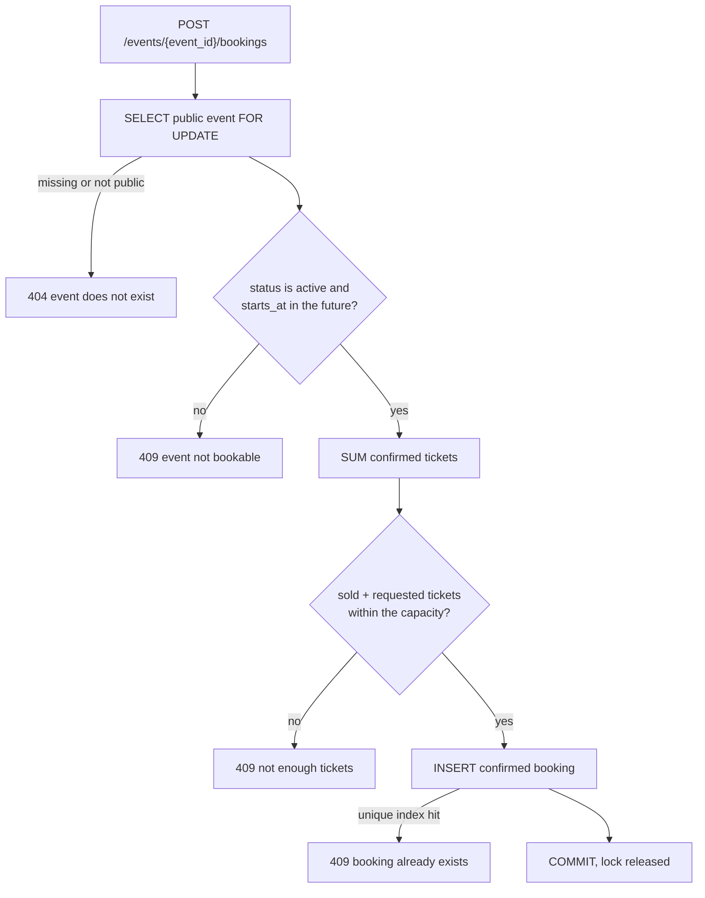

# 📐 Design
The detailed application design description.

## Table of contents
- [Layers](#layers)
  - [API structure](#api-structure)
  - [Assistant classes and access control](#assistant-classes-and-access-control)
- [Access and ownership control](#access-and-ownership-control)
  - [Access control](#access-control)
  - [Ownership control](#ownership-control)
- [Roles, user types and privileges](#roles-user-types-and-privileges)
  - [Roles](#roles)
  - [Role promotion policy](#role-promotion-policy)
  - [User types and their privileges](#user-types-and-their-privileges)
- [Events and bookings](#events-and-bookings)
  - [Event status description](#event-status-description)
  - [Event status policy](#event-status-policy)
  - [Event row lock](#event-row-lock)
  - [One active booking per user and event](#one-active-booking-per-user-and-event)
  - [Cancelling an event cancels its bookings](#cancelling-an-event-cancels-its-bookings)
  - [Booking policy](#booking-policy)
  - [Event editing policy](#event-editing-policy)
- [API](#api)
  - [Pagination](#pagination)
  - [Response structure and uniform response envelope - `ApiResponse`](#response-structure-and-uniform-response-envelope---apiresponse)
  - [One vocabulary for codes and messages for standard responses and errors - `ApiInfo`](#one-vocabulary-for-codes-and-messages-for-standard-responses-and-errors---apiinfo)
  - [Exception handlers](#exception-handlers)
  - [Predefined status codes and error info with an error factory](#predefined-status-codes-and-error-info-with-an-error-factory)
- [Data integrity](#data-integrity)
  - [Hashed password leak protection and custom HashedPassword ORM defined column type](#hashed-password-leak-protection-and-custom-hashedpassword-orm-defined-column-type)
  - [UTC everywhere](#utc-everywhere)
- [Custom application tooling](#custom-application-tooling)
  - [API internal CLI - `python -m app.cli`](#api-internal-cli---python--m-appcli)
  - [Static analysis](#static-analysis)
  - [Logging](#logging)
- [Diagrams](#diagrams)
  - [Application structure](#application-structure)
  - [Assistants](#assistants)
  - [Event status transitions](#event-status-transitions)
  - [Booking process](#booking-process)

## Layers
### API structure
**routers -> endpoints -> schemas -> dependencies -> assistants -> services**

- **Routers**: Each router contains **Endpoints** grouped by a role that can access them.
- **Endpoints**: The endpoints use **Dependencies** to load features and required **Assistant** specified for a particular role that can access the endpoint. Endpoint request and response body are covered by designated **Schemas**.
- **Schemas**: Request forms, response data validation and SQLAlchemy model filtration. Models that are returned from the database are filtered by their designated ResponseModel, so any unnecessary data won't reach the client. Each response has a special ApiResponse wrapper that is used to achieve unified response structure for the API client.
- **Dependencies**: Used to load the tools and features that an endpoint requires, like Assistant classes or Pagination feature.
- **Assistants**: Each assistant covers user role functions. It ships the whole endpoint logic, verifies user access and token data.
- **Services**: Functions responsible only for database communication. Used only by assistants, never inside an endpoint, since these tools aren't responsible for access control. Services commit the data and raise database errors.

### Assistant classes and access control
The API endpoint access control is role-based and all of that resides within assistant classes. Each router is grouped by a role that can access the endpoints inside, and each of them, via a dependency, imports its designated assistant, which controls access and confirms the user data extracted from the JWT with the database. Assistant classes also include services that allow them to communicate with the database and perform operations on data.

We have 5 types of assistants:
- **AuthAssistant**: for non-authorized users, only authorization.
- **PublicAssistant**: for non-authorized users, only public functions.
- **UserAssistant**: for registered users with account related options and booking features.
- **OrganizerAssistant**: for event organizer accounts, covers all event related functions. Includes all *UserAssistant* features.
- **AdminAssistant**: application maintaining account, admin features. Includes all *UserAssistant* and *OrganizerAssistant* features.

The role assistants form a chain rather than three separate classes. `UserAssistant` is the root, because every account is a user. `OrganizerAssistant` inherits from User and `AdminAssistant` inherits from Organizer.
A higher role reaching a lower role's route is therefore achieved through method inheritance. The `MINIMUM_ROLE` check on the route decides whether to establish access or not.

The root `UserAssistant` class takes also every database service, so the subclasses need no constructor of their own. `PublicAssistant` and `AuthAssistant` stay outside the chain, since neither has an authenticated caller to verify.

## Access and ownership control
### Access control
Access to an API route and to a database resource is determined by two independent factors: the caller's role and the ownership of the resource.

An account, once promoted to a higher role, does not lose its previous privileges. Instead it inherits them, therefore its access can only widen.

### Ownership control
At first, the designated assistant class extracts user data from the JWT and confirms it with the database. This is deliberate in this shape to avoid a situation when a user role is downgraded, since a JWT has a 30 minute expiration time (configurable).

Then using verified User ID and role, ownership on database resources is checked using ORM. Any attempt to access somebody else's or non-existent data ends up with the same 404 error. Therefore presence of data isn't revealed.

## Roles, user types and privileges
### Roles
User[10] < Organizer[20] < Admin[30]

Each registered account starts as a regular User, with basic functionality. The account role can be upgraded or downgraded by an Admin account. The role permissions are inherited, therefore a higher role also has the functionality of the lesser roles. Organizer keeps all User functionality and Admin has those of User and Organizer, plus its own.

### Role promotion policy
The role carried by the token is informational only. Every assistant re-reads it from the database, so a promotion or a demotion takes effect on the next request, without the account having to log in again.

The alternative would be to trust the token claims and deactivate the token whenever an operation changes account permissions, forcing a new login. That approach would require keeping a list of valid tokens in Redis, for speed reasons.
Doing the same in Postgres would make no sense, since Redis holds its data in RAM and a token has to be confirmed on almost every request.

### User types and their privileges
- **Visitor**: an unauthenticated caller, with no account and no access token. Browses published events and can register an account.
- **User**: a registered account with access to the basic operations. Books tickets for active published events, lists its own bookings and cancels them.
- **Organizer**: an account with access to event-oriented endpoints. Creates events, edits them, moves them through their statuses,
publishes them, cancels them, deletes a draft, and reads the participant list of an owned event.
- **Admin**: the highest role, used to maintain the application. Reads any account credentials (except the password) and detailed
event info. The only role that can change the role of another account.

## Events and bookings
### Event status description
Five statuses, kept in the column by the `ck_events_status` constraint, so others aren't allowed.

| Status | Meaning |
|---|---|
| `draft` | The event exists for its owner only. It can never be public, which `ck_events_draft_not_public` enforces in the database, and it is the only status that can be hard deleted, since a draft was never publicly visible and never booked. |
| `active` | The working state. It can be published, once, and a published one accepts bookings until it starts. |
| `locked` | Visible and still inside the lifecycle, but taking no new bookings. It returns to `active`, which is what an organizer uses while editing, especially while lowering the event capacity. |
| `finished` | Terminal. The event is kept as history, and is neither editable nor cancellable. |
| `cancelled` | Terminal. Reached only through the designated cancel endpoint, never through a status change, because it has to cancel the confirmed bookings in the same transaction. |

`draft` and `locked` are the two that carry no meaning to a client on their own: a draft is invisible, and a locked event looks exactly like an active one except that booking is refused.

### Event status policy
Allowed event status transitions:
- draft -> active
- active -> locked / finished
- locked -> active
- finished -> none
- cancelled -> none

Publishing can only be performed on an active event, never a draft. It cannot be reversed: withdrawing an event can be done by cancelling it. Cancellation is reached through a dedicated endpoint,
since besides the status change, it also cancels the current bookings.

Publishing is also guarded by the database itself. The `ck_events_draft_not_public` constraint makes a public draft impossible.

### Event row lock
Operations on events are critical and several of them can collide on the same row: booking, editing, a status change and cancelling. A row lock keeps them from hitting each other.
Every operation that touches a particular event row locks it first using SELECT ... FOR UPDATE. Therefore operations like changing an event status or booking are queued with any
other that touches the same event.

### One active booking per user and event
The database holds a partial unique index on (user_id, event_id) WHERE status = 'confirmed', so the same event cannot be booked twice. Booking cancellation drops the row out of the index, so the same user can book that event again.

### Cancelling an event cancels its bookings
This is the main reason why cancelling an event has a separate endpoint, instead of being covered by the status change. Both the event and all confirmed bookings on that event are cancelled in one transaction, since an error could leave confirmed bookings on a cancelled event, or the other way round.

The bookings are closed with a single `UPDATE`, with `synchronize_session=False`. The table may hold thousands of rows for one event, and none of them is ever read, so there is nothing to synchronize.

The default `auto` would try `evaluate` first, rebuilding the `WHERE` condition as a Python function to update objects already loaded. If it fails, it raises `UnevaluatableError` and the ORM falls back to `fetch`, which on PostgreSQL attaches
`RETURNING` and hands back the primary key of every modified row, only for all of them to be discarded. `False` removes those pointless side effects.

### Booking policy
A booking is accepted only when every one of these holds. All of them are checked while the event row is locked, so a request cannot pass them on a state another request is already changing.

- The event is publicly visible. A non-public one answers 404, exactly like a missing id, so a draft never reveals its presence.
- Event status is `active`. A `locked` event stays visible and stays in the lifecycle, but takes no new bookings.
- Event has not started yet: `starts_at` must be in the future.
- The tickets aren't sold out. The amount of confirmed tickets plus the amount the user requested does not exceed the event capacity.
- The caller has no active booking on that event yet.

The requested amount is validated before booking, in the schema: between 1 and 10 tickets per booking.

Cancelling changes the booking status and nothing else. The tickets return to the available pool by themselves, because only confirmed rows are counted while booking. There is no counter in the database.

Cancelled bookings are kept and still appear in the caller's own booking listing, so an account keeps its full reservation history.

### Event editing policy
The event row is locked before anything is checked, so the booked ticket count is the real one.

A finished or cancelled event is refused. Their bookings are kept as history, and rewriting the event would rewrite history too.

Capacity may be lowered, but never below the tickets already sold. The limit is the confirmed booking count, which is read while the event is locked.

Dates are frozen once someone holds a ticket. Editing them would hand the attendee a ticket for a date they never agreed to, and there is nothing to notify them with yet.

Moving the event to `locked` status is not required before an edit, but it is the option a front end should offer to the organizer, especially while lowering the capacity.

## API
### Pagination
Listing endpoints take `page` and `per_page` as query parameters, validated by the `PaginationParams` model: the page starts at 1, the size defaults to 20 and is capped at 100. The model also calculates `offset`, which is what the query actually needs.

The answer comes back as `Page[ITEM]` inside the envelope, carrying the items, the current page, the page count and the total row count. The page count is calculated from the total, so the client can render controls and total info without a second request.

Every listing is ordered deterministically with `id` breaking ties. Without a deterministic order, `OFFSET` can return the same row on two pages or skip it.

The dependency is `Annotated[PaginationParams, Depends()]`, not `Query()`. With `Query()`, adding any additional query parameter to the endpoint body would collapse `page` and `per_page` into a single unreachable `?pagination=`.
The cost of `Depends()` is that `extra="forbid"` stops working, so an unknown query parameter is ignored instead of answering 422.

### Response structure and uniform response envelope - `ApiResponse`
Every answer carries `status`, `code`, `message` and `data`. The first three describe what happened, the fourth carries the payload, and the generic parameter determines what type is supposed to be within the endpoint body.

```python
class ApiResponse[RESPONSE_MODEL](BaseModel):
    status: Literal["success", "fail", "error"]
    code: str
    message: str
    data: RESPONSE_MODEL | None = None
```

Response is never built by hand. Three classmethods: `success`, `fail` and `error` - take an `ApiInfoItem` and place its `CODE` and `MESSAGE` into the envelope.
```python
@classmethod
def success(
    cls,
    info: ApiInfoItem,
    data: RESPONSE_MODEL | Any = None,  # Any used to avoid type errors
) -> ApiResponse[RESPONSE_MODEL]:

    return cls(
        status="success",
        code=info.CODE,
        message=info.MESSAGE,
        data=data,
    )
```
`fail` and `error` are the same method with a different `status`.

An endpoint declares the parametrised envelope as its `response_model` and returns the same type. FastAPI then validates and filters the provided data with the given Pydantic schema.
```python
@user_router.get(
    "/me",
    status_code=status.HTTP_200_OK,
    response_model=ApiResponse[UserResponse],
)
def get_me_info(
    user_assistant: user_assistant_dependency,
) -> ApiResponse[UserResponse]:

    me_model = user_assistant.get_me()

    return ApiResponse[UserResponse].success(
        ApiInfo.ME_INFO_RETRIEVED,
        data=me_model,
    )
```
Note what `data=me_model` passes: a SQLAlchemy model, not a `UserResponse`. Pydantic `UserResponse` schema then converts it through `from_attributes` while building the envelope, and the schema decides which columns survive that conversion.

A listing nests one generic param inside the other: `data` holds a `Page`, the page holds the items, the number of pages and total row count.
```python
@user_router.get(
    "/me/bookings",
    status_code=status.HTTP_200_OK,
    response_model=ApiResponse[Page[BookingResponse]],
)
def list_me_bookings(
    user_assistant: user_assistant_dependency,
    pagination: pagination_dependency,
) -> ApiResponse[Page[BookingResponse]]:

    page = user_assistant.list_me_bookings(pagination)

    return ApiResponse[Page[BookingResponse]].success(
        ApiInfo.ME_BOOKINGS_RETRIEVED,
        data=page,
    )
```

The only additions are `pagination_dependency`, which reads the page and per_page (items per page) from the query string. The assistant method takes pagination parameters and returns a ready `Page`.

The parameter varies between endpoints, examples:
| Parametrisation | Used for |
|---|---|
| `ApiResponse[UserResponse]` | a single object |
| `ApiResponse[Page[BookingResponse]]` | one page of a listing, with the number of pages and the total row count |
| `ApiResponse[None]` | an action that answers with a status and no payload, such as a password change |

### One vocabulary for codes and messages for standard responses and errors - `ApiInfo`
Every code and message the API can return is declared once in `ApiInfo`, as an `ApiInfoItem` and has `CODE` and `MESSAGE`.

```python
USER_ALREADY_EXISTS = ApiInfoItem(
    CODE="USER_ALREADY_EXISTS",
    MESSAGE="User already exists.",
)
```

The same items serve both paths: a router passes the info to `ApiResponse.success` (fail or error) and `HTTPErrorItem` holds one as its `INFO`. The vocabulary of infos that a client sees lives in a single file.
The item is a frozen dataclass with `slots=True`, so a code and its message cannot be changed at runtime and no attribute can be added, even by accident.

### Exception handlers
Custom exception handlers are configured, together with error logging. They also catch the 404 and 405 produced by FastAPI routing, when a route is not found or the method is not allowed.
This works because the handler is registered on the `HTTPException` imported from `starlette.exceptions`, not the one from `fastapi.exceptions`. FastAPI actually uses the one from `starlette.exceptions` there as well.

Four handlers cover every application exception path:
| Exception | Answer |
|---|---|
| `HTTPException` | the status code it was raised with, inside the envelope |
| `RequestValidationError` | 422, with the provided error fields in `data` |
| `ResponseValidationError` | 500, `RESPONSE_VALIDATION_ERROR` |
| `Exception` | 500, `INTERNAL_SERVER_ERROR` |

### Predefined status codes and error info with an error factory
Every error is declared once as an `HTTPErrorItem`: a status code, a code and message pair, and optional headers.

Raise them by calling:
```python
raise HTTPError.FORBIDDEN()
```
The call is very important. Each raise builds a **new** `HTTPException`, rather than reusing a predefined instance, since an exception instance accumulates a traceback and a cause. This would make the logs contain the wrong level and a foreign traceback, and slowly leak RAM.

The factory also takes optional data, so a raised error can carry an additional message. Example:
```python
raise HTTPError.INVALID_STATUS_TRANSITION(
    {
        "current": current_status,
        "allowed": sorted(current_status.next_statuses),
    }
)
```

## Data integrity
### Hashed password leak protection and custom HashedPassword ORM defined column type
A custom SQLAlchemy column type refuses anything but a hash on write and rebuilds it as a `HashedPassword` class on read. A plaintext row inserted by raw SQL will fail on the first read.

The password value travels between the functions as `HashedPassword`, a subclass of Pydantic's `SecretStr`, so it masks itself in, for example, `__repr__`, `__str__` and log files. It is only unwrapped where the exact content is needed.

The `HashedPassword` constructor raises `ValueError` for anything the `PasswordHasher` class does not recognise as its own output. Therefore the class never contains a value that wasn't previously hashed with a known set of algorithms.

### UTC everywhere
The database, the containers and the tokens all operate exclusively on UTC and the application itself converts no timezones. Time conversion is left for an API client. All date fields in request models are of `AwareDatetime`, therefore require an explicit UTC offset to be provided. Naive datetime objects raise an error, since the database server would interpret a naive datetime as UTC, which would actually corrupt the data logic.

## Custom application tooling
### API internal CLI - `python -m app.cli`
That CLI is one of the application components and resides in `app/cli.py`. It currently holds one command, `create-bootstrap-admin`, which creates the first admin on boot when the database has none
and does nothing when one exists.

It reuses the db models, the settings and a session. The container entrypoint and `builder local up` both call it after the migrations.

### Static analysis
`ruff` and `mypy` run on every push in separate CI jobs, so a lint failure cannot hide a type error.

### Logging
Every component writes into its own subdirectory, `<LOG_DIR>/<component>/<component>.log`, so that the application, the CLI, the HTTP access log and the uvicorn server log never share a file and rotate independently.

The root logger is the one owned by the application process and the only one that gets a console handler. A named logger receives the file handler alone, leaving its level and its existing handlers untouched.

Uvicorn's loggers are set to `propagate=False`, so their records do not reach the root logger and end up written twice.

The file handler always records at `DEBUG`, while the console is filtered separately by `LOG_LEVEL_CONSOLE`. That way `docker compose logs` stays readable while the file keeps the full trace. Files rotate at `LOG_MAX_BYTES` and keep
`LOG_BACKUP_COUNT` older copies, so the directory never needs manual cleanup. Timestamps are forced to UTC regardless of the host clock.

## Diagrams
Simplified description of application mechanics, represented in diagrams.

### Application structure


### Assistants


### Event status transitions


### Booking process


The event row stays locked from the `SELECT ... FOR UPDATE` to the `COMMIT` or `ROLLBACK`, therefore any attempt to edit or book the same event is queued by Postgres.
